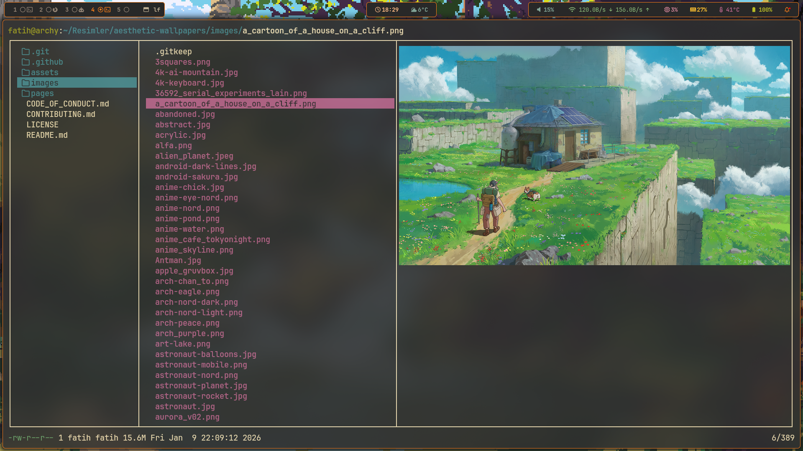
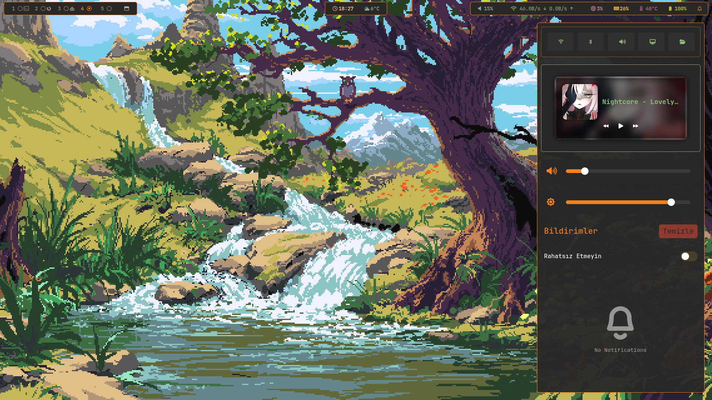
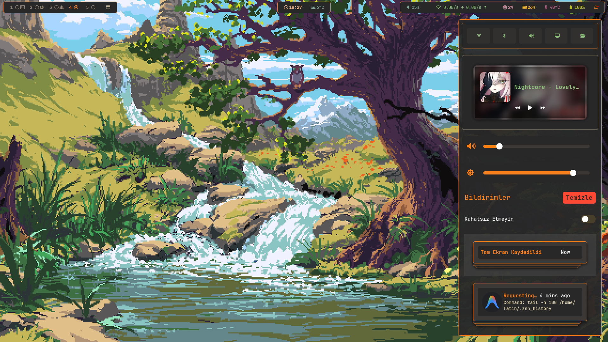
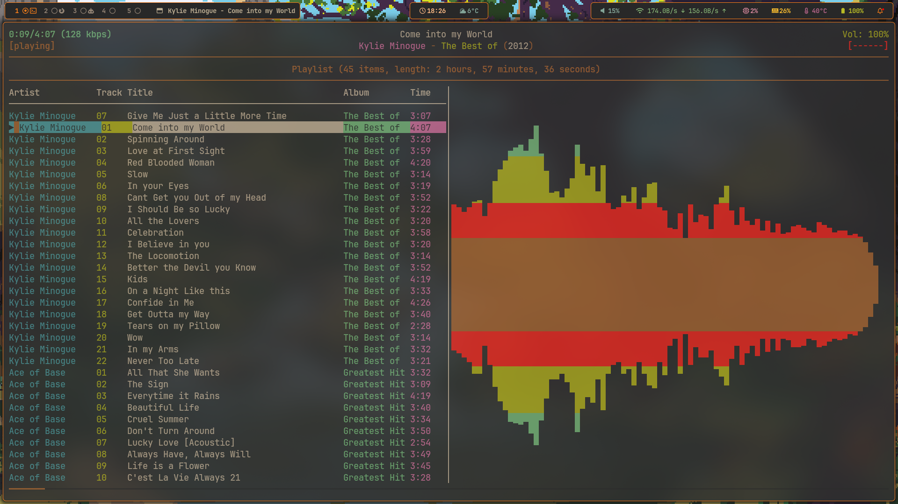
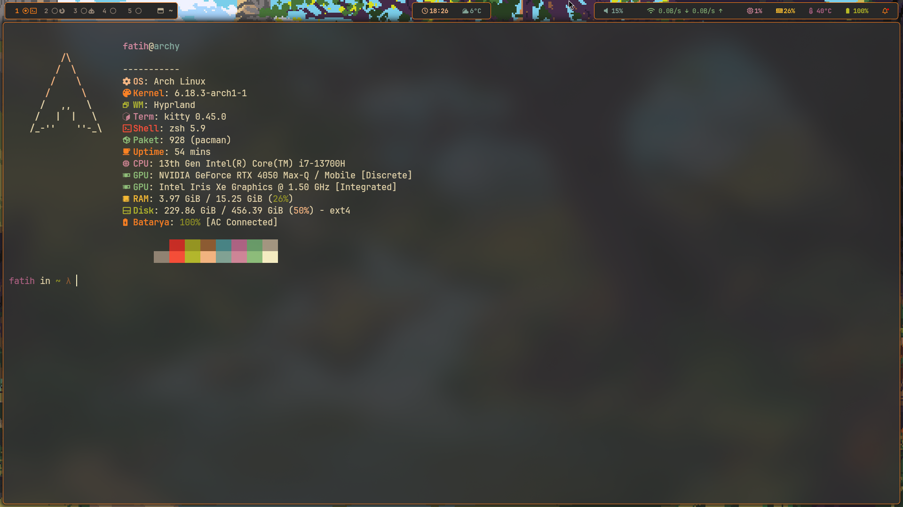

# Arch Linux Magic Setup (Dotfiles)

Bu depo, kişiselleştirilmiş bir Arch Linux (Hyprland odaklı) kurulumunu saniyeler içinde tamamlaman için hazırlanmıştır.

## � Ekran Görüntüleri

<p align="center">
  
  
</p>
<p align="center">
  
  
  
</p>

## �🚀 Neleri Kurar?

- **Pencere Yöneticisi:** Hyprland (Core tools: hyprlock, hypridle, hyprpicker, hyprcursor)
- **Panel:** Waybar & swaync (Bildirim Merkezi)
- **Terminal:** Kitty
- **Editor:** Neovim
- **AUR Helper:** yay-bin (Hızlı kurulum için)
- **Dosya Yöneticisi:** Thunar (Arşiv & resim önizleme desteğiyle) & lf
- **Görünüm & Tema:** nwg-look (GTK ayarları), swww (Wallpaper), Bibata Cursors
- **Multimedya:** ncmpcpp, cava, mpv, imv (Resim), playerctl & pamixer (Ses kontrol)
- **Diğer:** wofi (Launcher), cliphist (Pano), swappy (Resim düzenleme)

## 🛠️ Nasıl Kullanılır?

Yeni kurulmuş bir Arch Linux sisteminde terminali açın ve şu adımları izleyin:

1.  **Klasöre giriş yapın:**
    ```bash
    cd ~/dotfiles
    ```

2.  **Scripti çalıştırılabilir yapın:**
    ```bash
    chmod +x install.sh
    ```

3.  **Setup'ı başlatın:**
    ```bash
    ./install.sh
    ```

4.  **Sistemi yeniden başlatın.**

## 📁 Dosya Yapısı

- `.config/`: Uygulama konfigürasyon dosyaları.
- `.local/bin/`: Özel scriptler ve kilit ekranı sarmalayıcıları.
- `install.sh`: Otomatik kurulum scripti.

## ⌨️ Temel Tuş Atamaları (Hyprland)

Tüm kısayollar Catppuccin Mocha teması ve verimlilik odaklı ayarlanmıştır. `SUPER` tuşu genellikle **Windows** tuşudur.

| Kısayol | İşlem |
| :--- | :--- |
| `SUPER + Enter` | Kitty Terminal |
| `SUPER + Q` | Pencereyi Kapat |
| `SUPER + D` | Uygulama Menüsü (Wofi) |
| `SUPER + E` | Dosya Yöneticisi (Thunar) |
| `SUPER + B` | İnternet Tarayıcısı (Firefox) |
| `SUPER + V` | Floating Modu Değiştir |
| `SUPER + F` | Tam Ekran |
| `SUPER + L` | Ekranı Kilitle |
| `SUPER + H` | Pano (Clipboard) Geçmişi |
| `SUPER + N` | Bildirim Merkezi (SwayNC) |
| `SUPER + C` | Hızlı Notlar (Neovim) |
| `SUPER + U` | Scratchpad (Gizli Terminal) |
| `SUPER + Esc` | Güç Menüsü (Kapat/Yeniden Başlat) |
| `Print` | Tüm Ekran Görüntüsü |
| `Shift + Print` | Seçili Alan Görüntüsü |

## 🛠️ Uygulama Kılavuzu

### 🎵 Müzik (ncmpcpp & mpd)
- Müzik dinlemek için terminalde `ncmpcpp` yazın.
- `1`: Yardım, `2`: Çalma Listesi, `4`: Kütüphane, `8`: Görselleştirici.

### 📂 Dosya Yönetimi (lf & Thunar)
- Görsel arayüz için `SUPER + E` (Thunar).
- Terminal tabanlı hızlı gezinti için terminalde `lf` yazın.

### 📝 Not Alma (QuickNotes)
- `SUPER + C` ile anlık not defterini açabilirsiniz. Bu dosya `~/quicknotes.md` olarak kaydedilir.

### 📋 Pano Yönetimi (Cliphist)
- `SUPER + H` ile daha önce kopyaladığınız her şeye (metin ve resim) ulaşabilirsiniz.

### 🎨 Görünüm Özelleştirme
- **Tema:** Catppuccin Mocha
- **Bar:** Waybar (Üstte, şeffaf ve modern)
- **Bildirimler:** SwayNC (Catppuccin Mocha stili)

## ⚠️ Önemli Notlar

- Script otomatik olarak `sudo` yetkisi isteyecektir.
- Mevcut bir sistemde çalıştırıyorsanız, `.config` klasörünüzdeki dosyaların üzerine yazılacağını unutmayın.
- Kurulumdan sonra kursor temasının ve fontların aktif olması için bir kez oturumu kapatıp açmanız önerilir.
